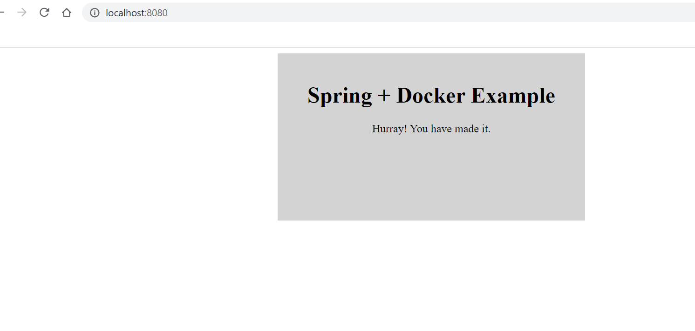

# SpringBoot + Docker bare minimum app

## System Requirement

1. Maven
2. Java 8
3. Docker for Windows or Mac

### Package the Jar

1. `cd <project dir>`

2. ` mvn clean install `

### Build and Run Image

1. Make sure docker is running i.e. `docker ps`
2. build the image `docker build .`
3. or build image with a tag `docker build -t <docker-hub-name>/<image-name>`
4. Next step is to run the image
   `docker run -p 8080:8080 <image-id> or <docker-hub-name>/<image-name>`

5. Go to browser and type `localhost:8080`

we should see landing page of our app

## Congrats! you have springboot app running in a container.

Verify

`docker ps` -> should show the current container running